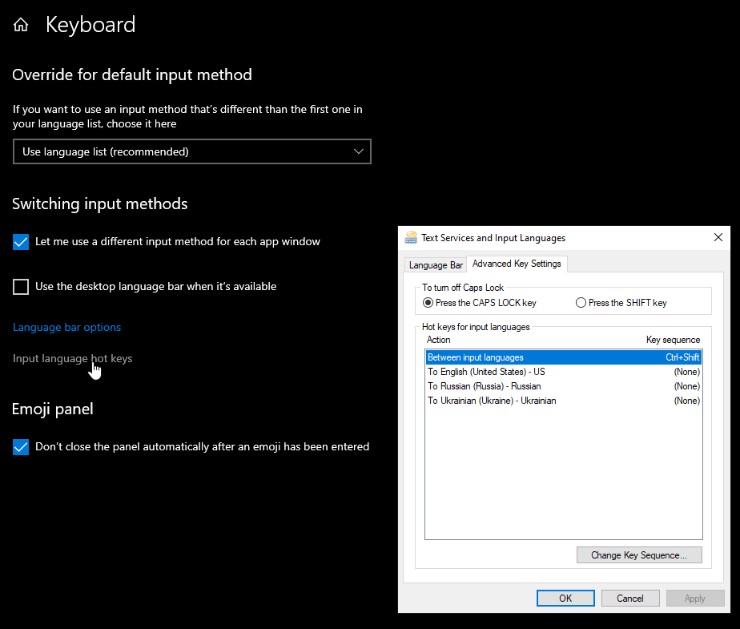

# Keyboard language shortcut

This software is made to allow change of language with direct shortcut (e.g. Ctrl-1 for English, Ctrl-2 for Polish) in Windows. 

<!-- TOC -->

- [Installation](#installation)
- [Notes](#notes)
    - [Note on enhanced layouts e.g. US Dvorak](#note-on-enhanced-layouts-eg-us-dvorak)
    - [Operating systems](#operating-systems)
    - [Releases](#releases)
    - [Further development](#further-development)
- [Thanks](#thanks)
- [Support](#support)

<!-- /TOC -->

Windows does have system dialog to set language shortcuts:

Over the years and many windows version (windows 7, 10) multiple updates to windows 10 this option had proven to be unstable (while sequence shortcut usually Ctrl-Shift works fine direct shortcuts after several reboots stop working and have to be entered again). Hence this application.

Application does not change cycling through languages via standart (usually Ctrl-Shift).

## Installation

This is a simple application. Download zip file from the releases section of github and unzip it somewhere on your computer.

Edit supplied sample languages.conf file (for options see comments in the file).

Keyboard languages does not need to be installed separately if they are not available - application will load those via Windows API.

If you wish for application to start during windows startup automatically, the right press on the application language.

In case application (language) icon is hidden you can force it to be visible all the time (see - [how to show icon](https://www.supportyourtech.com/tech/how-to-show-hidden-icons-on-taskbar-windows-11-a-step-by-step-guide/))

## Notes

Shortcut can be a combination of ctrl, alt, win and shift modifiers and a single key (this is limitation of windows API, so cannot be changed). Application will be developed to accept multiple keys).

For list of virtual keys see [Windows virtual codes](https://learn.microsoft.com/en-us/windows/win32/inputdev/virtual-key-codes). 

Digits and special keys are working as shortcuts starting version v0.4 2026Jun24. For special keys see key codes VK_OEM_XXXX as symbols (e.g. '=') will not work directly. For key with '=' and '+' VK_OEM_PLUS code should be used. See link to list of virtual codes above.

For list of supported keyboard layouts see [Windows keyboard layouts codes](https://learn.microsoft.com/en-us/windows-hardware/manufacture/desktop/windows-language-pack-default-values?view=windows-11)

Stability of the application is tested during several years of development and everyday use. For shortcuts and languages where it is working - it does not require restarts.

### Note on enhanced layouts (e.g. US Dvorak)

Such layouts change where keys are located on the keyboard (including VK_ keys). This can be probably best overcome with ability to have multiple shortcuts for one keyboard layout (e.g. Ctrl-P on US Intl. layout and Ctrl-L on Dvorak will be the same combination of physical keys). This will be addressed in next few releases of the application.

### Operating systems

Only windows (tested on Windows 10) OS is supported. No plans for other operating systems. Although the application is in free pascal (which is cross platform), application relies heavily on OS specific keyboard APIs, which I believe would be hard to port for other OSes.

### Releases
See [Releases](/documentation/RELEASES.md) page

### Further development

* Add support for custom language icon files
* Add dark language icons
* Add language selection via right click menu on language icon

## Thanks

* Icon set is made by loopakel@gmail.com
* Amazing [lazarus IDE and free pascal](https://www.lazarus-ide.org/)
* This file is converted to HTML with https://markdowntohtml.com/

## Support

For questions/bug reports, please go to [discord channel for this application](https://discord.gg/dH48ShUhGm).